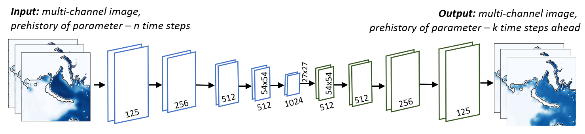
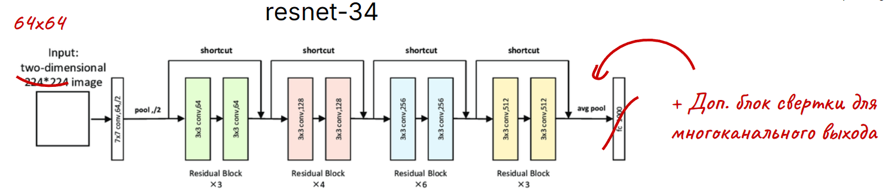
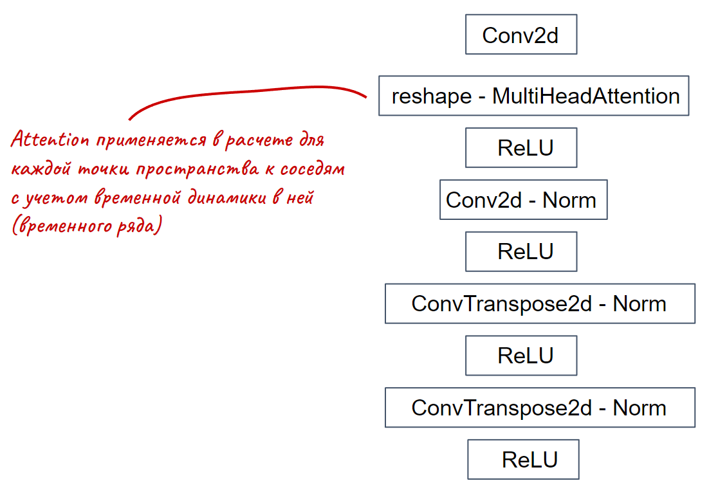
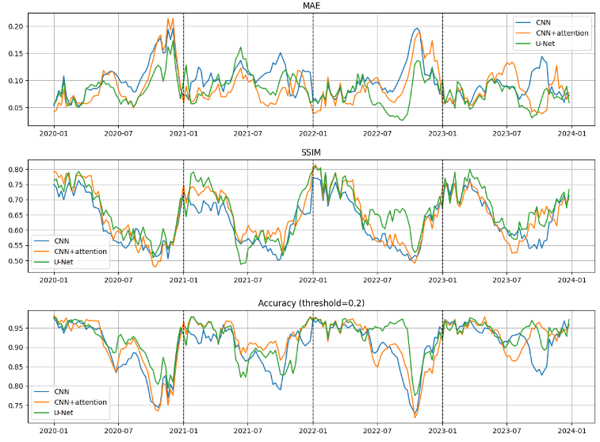
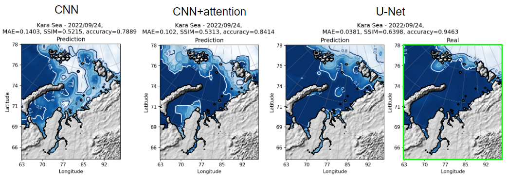

Репозиторий содержит код по проекту ***"Is attention all you neen? - CNN + attention for spatio-temporal data forecasting"***, выполненный за время школы по ИИ Лето с AIRI 2025.

Развернутый отчет о проделанной работе представлен в  [файле](Is%20attention%20all%20you%20need%20-%20REPORT.pdf).

**Решаемая задача** - долгосрочное прогнозирование концентрации льда в Арктике на примере Карского моря.

Опробованы три архитектуры:

- базовая, на основе простых сверток (CNN);

- "классическая data-driven", U-Net (resnet-34);

- сверточная с механизмом внимания (CNN+attention).

Ход метрик качества для каждого шага прогноза на графиках:

Для наиболее неоднозначного временного промежутка прогноза построены ледовые карты на основе выхода из нейронных сетей:

**Выводы:**

- U-Net показал лучшее качество по сравнению с моделью с механизмом внимания, что подтверждает негласный статус U-Net как базовой модели для прогнозирования ледовой обстановки;
- Добавление в архитектуру U-Net механизма внимания может повысить качество для прогнозирования типичной динамики ледовых условий;
- Протестированные архитектуры (U-Net, CNN+attention) все еще требуют параметризации для каждой акватории, генерализуемость подхода нуждается в доработке.
